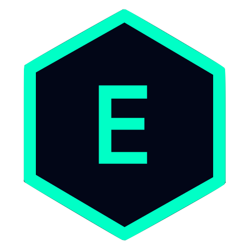
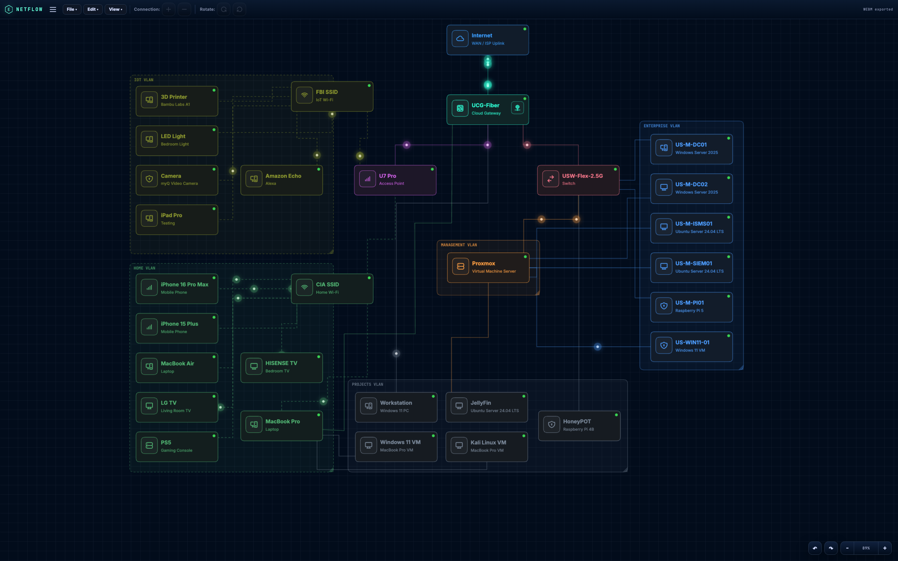
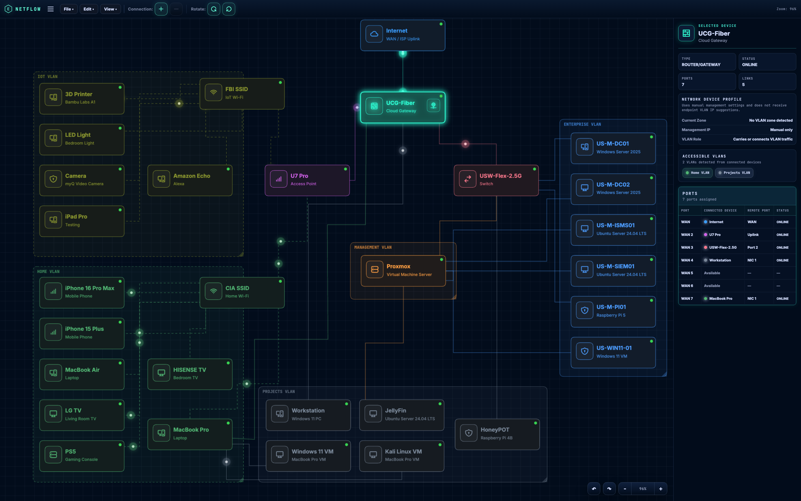
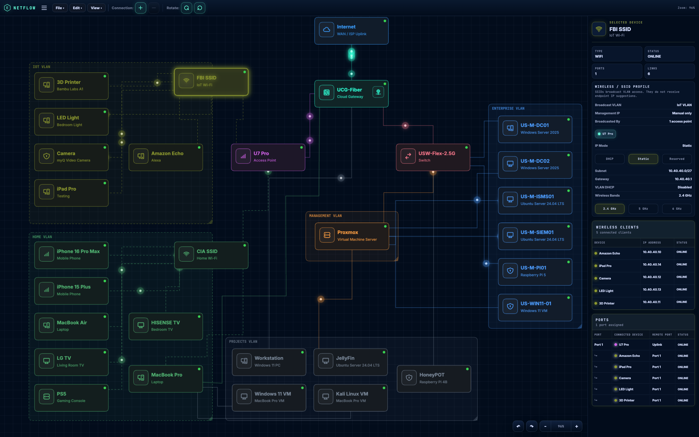
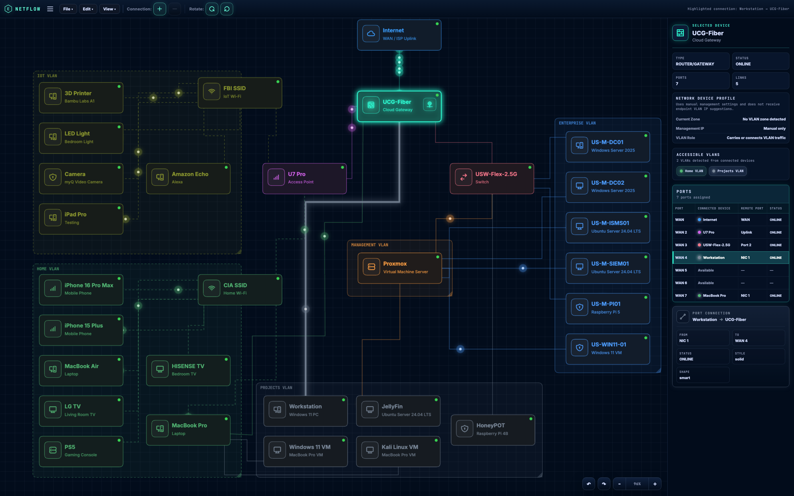
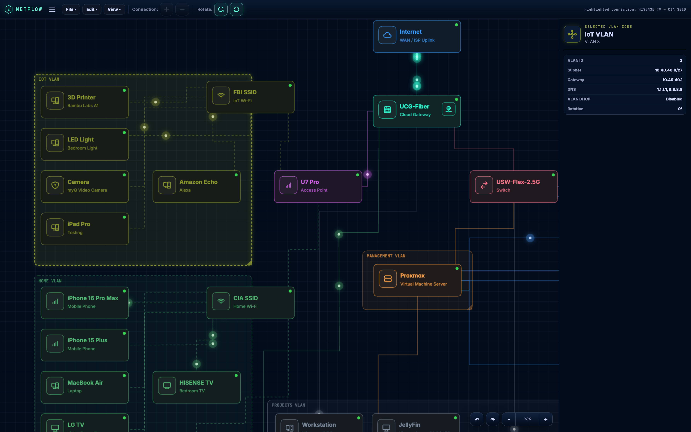

<div align="center">



# NetFlow

### Interactive Network Topology and VLAN Planning

A browser-based network architecture workbench for designing physical connections, documenting port assignments, organizing VLANs, and visualizing segmented environments.

[Launch Live Demo](https://esixtosr.github.io/NetFlow/network/home-lab/) ·
[Watch Demo](./assets/videos/netflow-demo.webm) ·
[View Source](https://github.com/esixtosr/NetFlow)

</div>

---

[](https://esixtosr.github.io/NetFlow/network/home-lab/)

## Overview

NetFlow is an interactive network topology editor built to document both the physical and logical sides of a network.

Instead of creating only a static diagram, NetFlow tracks devices, ports, connections, IP settings, VLAN membership, wireless clients, and network boundaries inside one browser-based workspace.

The included home-lab topology demonstrates a segmented environment containing:

- Internet and gateway infrastructure
- Managed switching and wireless access
- Enterprise, management, projects, home, and IoT VLANs
- Physical servers and virtual machines
- Wired and wireless client relationships
- Port-level device connections

The application is built with vanilla JavaScript, HTML5 Canvas, and CSS without a front-end framework.

## Key Features

### Interactive topology canvas

Create, position, rotate, and connect network devices on a zoomable grid-based workspace. Connections use orthogonal routing and remain attached while devices are moved.

### Port-aware connections

Connections are assigned between specific interfaces rather than being represented as unlabeled lines.

For example:

```text
UCG-Fiber WAN 3 → USW-Flex-2.5G Port 2
UCG-Fiber WAN 2 → U7 Pro Uplink
Workstation NIC 1 → UCG-Fiber WAN 4
```

Selecting a port highlights the associated connection and displays both endpoints.

### Device and network profiles

The sidebar changes according to the selected object and can display:

- Device type and status
- Port availability and assignments
- Connected and remote interfaces
- IP address and addressing mode
- Subnet, gateway, and DNS information
- VLAN inheritance
- Accessible VLANs
- Wireless bands and connected clients

### VLAN segmentation

Devices can be grouped within visual VLAN zones containing network configuration such as:

- VLAN ID
- Subnet
- Gateway
- DNS servers
- DHCP status
- Zone color and rotation

Endpoint devices inherit network information from their containing VLAN while infrastructure devices retain dedicated management and trunking information.

### Wireless network modeling

SSID objects represent wireless networks separately from access points.

Each SSID can document:

- Broadcast VLAN
- Broadcasting access point
- Static or dynamic addressing
- Wireless bands
- Connected wireless clients
- Client IP addresses and status

### Connection visualization

Selecting a connection highlights its complete path and displays:

- Source device and port
- Destination device and port
- Connection status
- Line style
- Routing shape

Animated particles can also be used to visualize traffic paths throughout the topology.

### Import and export

NetFlow supports browser-side project management and documentation export, including:

- JSON project files
- PNG topology images
- WebM topology recordings
- Local browser persistence
- Undo and redo history

---

## Feature Preview

<table>
<tr>
<td width="50%">

<br>
<strong>Port Management</strong><br>
View assigned, available, and connected interfaces for infrastructure devices.
</td>
<td width="50%">

<br>
<strong>Wireless Profiles</strong><br>
Document SSIDs, VLAN assignments, radio bands, and wireless clients.
</td>
</tr>
<tr>
<td width="50%">

<br>
<strong>Connection Tracing</strong><br>
Highlight a physical path and inspect both connected ports.
</td>
<td width="50%">

<br>
<strong>VLAN Documentation</strong><br>
Inspect logical network boundaries and their addressing information.
</td>
</tr>
</table>

## Demo

The live project opens with a complete home-lab topology so its functionality can be explored immediately.

### Live application

https://esixtosr.github.io/NetFlow/network/home-lab/

### Recorded walkthrough

[Open the NetFlow WebM demonstration](./assets/videos/netflow-demo.webm)

> The demonstration recording shows device selection, network profiles, VLAN details, wireless clients, port assignments, and connection highlighting.

---

## Example Architecture

The included topology models several isolated network areas:

| Network | Purpose |
|---|---|
| Management VLAN | Hypervisor and infrastructure management |
| Enterprise VLAN | Domain controllers, security systems, and enterprise services |
| Projects VLAN | Development, testing, media, and security lab systems |
| Home VLAN | Trusted personal devices and home wireless clients |
| IoT VLAN | Smart-home and restricted wireless devices |

Core infrastructure includes:

```text
Internet
   │
UCG-Fiber Gateway
   ├── U7 Pro Access Point
   ├── USW-Flex-2.5G Switch
   ├── Workstation
   └── Additional wired endpoints

USW-Flex-2.5G
   ├── Proxmox
   ├── Domain Controllers
   ├── Security and monitoring servers
   ├── Raspberry Pi systems
   └── Other physical infrastructure
```

This topology is an example environment and can be replaced with a custom network.

---

## Technical Design

NetFlow uses a modular client-side architecture.

```text
NetFlow/
├── assets/
│   ├── icons/
│   ├── images/
│   └── videos/
├── css/
│   └── styles.css
├── data/
├── js/
│   ├── app.js
│   ├── canvas.js
│   ├── config.js
│   ├── connections.js
│   ├── devices.js
│   ├── export.js
│   ├── history.js
│   ├── icons.js
│   ├── main.js
│   ├── modals.js
│   ├── sidebar.js
│   ├── state.js
│   ├── storage.js
│   └── zones.js
├── network/
│   └── home-lab/
├── index.html
└── README.md
```

### Technologies

- JavaScript
- HTML5 Canvas API
- HTML and CSS
- Browser LocalStorage
- MediaRecorder API
- JSON serialization
- GitHub Pages

No application server, database, account, or installation is required for the hosted demonstration.

---

## Run Locally

Clone the repository:

```bash
git clone https://github.com/esixtosr/NetFlow.git
cd NetFlow
```

Start a local web server:

```bash
python3 -m http.server 8000
```

Open:

```text
http://localhost:8000
```

A local server is recommended because the application uses JavaScript modules that may not work correctly when `index.html` is opened directly from the filesystem.

---

## Current Project Status

NetFlow currently supports:

- Device and VLAN creation
- Canvas positioning and rotation
- Port counts and port assignments
- Wired and wireless connections
- Device-specific network profiles
- SSID and wireless-client relationships
- VLAN inheritance and infrastructure overrides
- Connection highlighting
- Undo and redo
- JSON, PNG, and video export
- Browser-side project persistence

## Planned Improvements

- Improved automatic connection routing
- Expanded switch and firewall interface roles
- Additional device templates
- Connection validation and topology warnings
- Search and filtering for large environments
- Optional network inventory and documentation reports
- Improved mobile and tablet controls

---

## Why I Built It

NetFlow began as a way to document my own home-lab network without separating the physical topology, VLAN plan, port assignments, and device inventory across several diagrams and spreadsheets.

It has grown into a broader network planning tool that combines cybersecurity, network engineering, and front-end development in one project.

The project demonstrates practical experience with:

- Network segmentation
- VLAN design
- Physical and logical topology documentation
- Port and interface mapping
- IP addressing
- Wireless infrastructure
- Client-side state management
- Interactive canvas development
- Technical documentation

---

## Author

**Edwin I. Sixtos Ruiz**

Cybersecurity and Network Engineering student at Purdue University.

[GitHub Profile](https://github.com/esixtosr)

---

## License

This project is currently maintained as a personal portfolio and educational project.